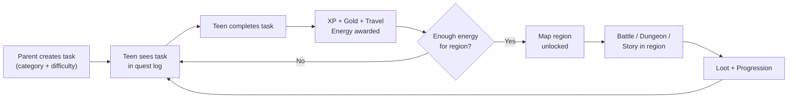
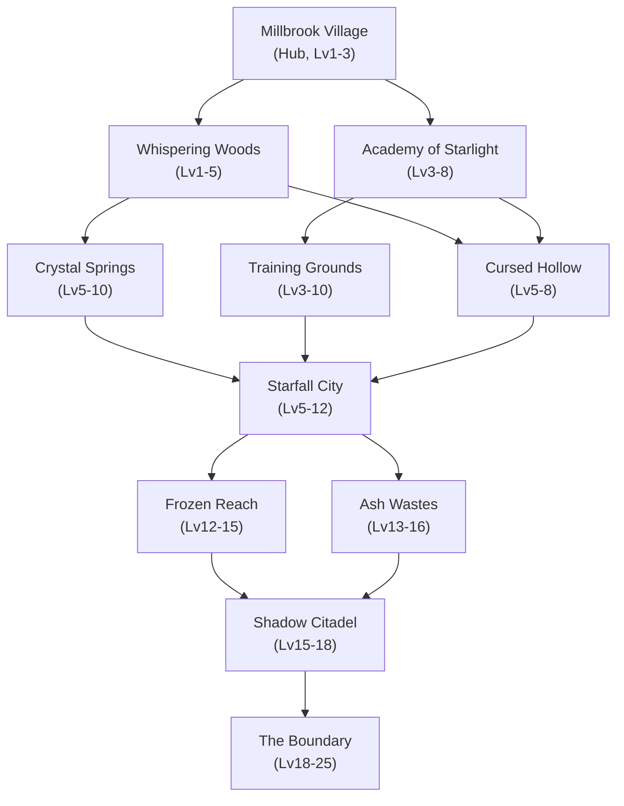
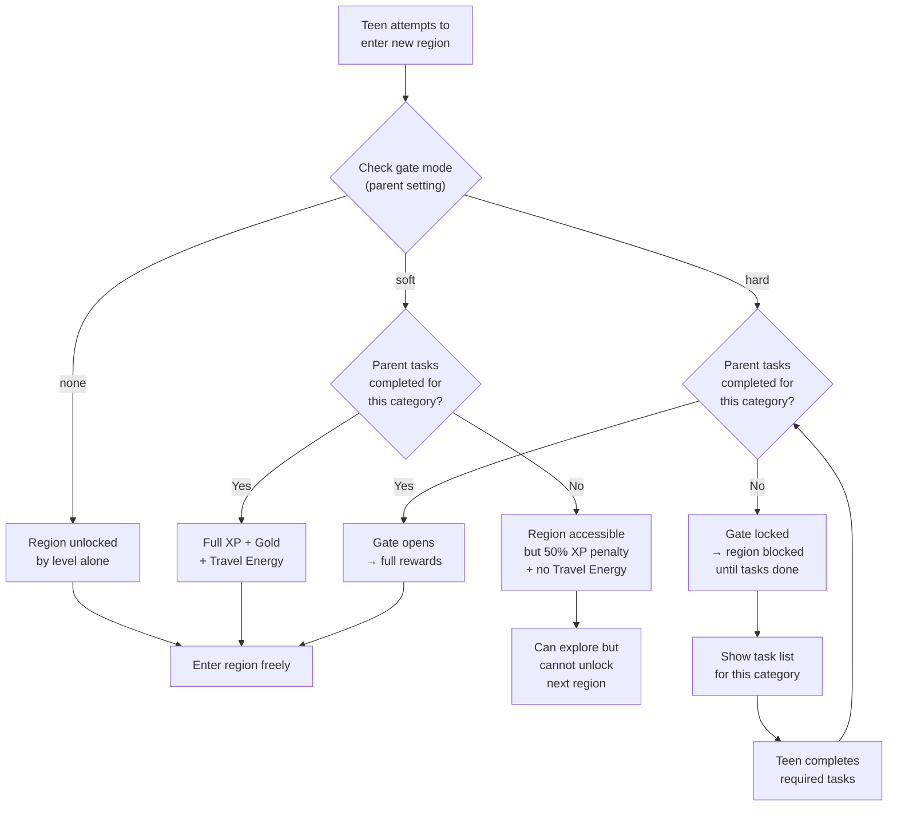

# MindQuest V2 Design Document

---

## 1. Overview

MindQuest is a gamified productivity app designed for teens with ADHD. It transforms real-world task completion into RPG progression — battles, loot, story chapters, and character growth.

**V1** established the core loop: complete tasks, earn XP, fight enemies, progress through a linear story with branching paths. It shipped with 28 enemies, 72 skill-tree nodes, crafting, dungeons, arena PvP, a prestige system, cosmetics, seasonal events, and a tutorial system across five development phases.

**V2** introduces three major additions:

- **World Map (Aethermoor)** — An explorable overworld with 11 distinct regions. Teens unlock and travel between regions as they level up and complete tasks. Each region contains its own enemies, dungeons, and story beats.
- **Parent Task System** — Parents create structured tasks (with categories, difficulty, and optional deadlines) through a PIN-protected dashboard. Task completion drives map progression, tying real-world responsibility directly to in-game exploration.
- **Asset Framework** — A scalable pipeline for AI-generated and hand-polished visual assets: static illustrations, sprite sheets, Lottie animations, and Rive state machines. This replaces placeholder art with a consistent, production-quality visual identity.

---

## 2. Architecture Flow

The core V2 loop connects parent-created tasks to world map exploration:



---

## 3. Task-to-Region Mapping

Each `TaskCategory` routes completed tasks toward a specific region on the world map. This creates a natural incentive: teens who want to unlock a particular region are motivated to complete the corresponding real-world task type.

| TaskCategory | Region | Thematic Link |
|---|---|---|
| `lifeSkills` | Whispering Woods | Self-reliance, chores, daily routines — survival skills mirrored by forest navigation |
| `academic` | Academy of Starlight | Study, homework, reading — scholarly pursuits in the academy |
| `health` | Crystal Springs | Hygiene, sleep, mindfulness — healing springs reflect wellness |
| `fitness` | Training Grounds | Exercise, sports, physical activity — combat training arena |
| `social` | Starfall City | Communication, teamwork, social events — the bustling city hub |
| `creative` | Starfall City | Art, music, writing, building — the creative quarter of the city |

> **Note:** `social` and `creative` both map to Starfall City. The city is larger and has two distinct sub-districts, giving it double the task input but also double the content to unlock.

---

## 4. World Map: Aethermoor

Aethermoor is a continent divided into 11 regions, arranged vertically from the safe hub village in the north to the endgame frontier in the south. Positions are normalized (0.0–1.0) for responsive layout across screen sizes.

| # | Region | Position (x, y) | Level Range | Biome | Task Link | Enemies | Dungeons |
|---|---|---|---|---|---|---|---|
| 1 | Millbrook Village | (0.50, 0.08) | 1–3 | Hub / Village | — (starting area) | Training Dummies, Mischief Sprites | None (tutorial area) |
| 2 | Whispering Woods | (0.25, 0.22) | 1–5 | Dense Forest | lifeSkills | Forest Wolves, Thorn Crawlers, Mushroom Lurkers | Hollow Oak Depths |
| 3 | Academy of Starlight | (0.75, 0.22) | 3–8 | Arcane Campus | academic | Rogue Constructs, Ink Wraiths, Exam Phantoms | The Forbidden Archive |
| 4 | Crystal Springs | (0.20, 0.38) | 5–10 | Hot Springs / Caverns | health | Spring Serpents, Crystal Golems, Mist Elementals | Subterranean Pools |
| 5 | Training Grounds | (0.80, 0.38) | 3–10 | Arena / Barracks | fitness | Sparring Knights, Iron Sentinels, Drill Commanders | The Gauntlet |
| 6 | Cursed Hollow | (0.50, 0.42) | 5–8 | Corrupted Swamp | story | Shadow Stalkers, Blight Toads, The Hollow Warden | Warden's Lair |
| 7 | Starfall City | (0.50, 0.55) | 5–12 | Coastal Metropolis | social / creative | Street Rogues, Clockwork Sentries, Guild Rivals | City Undercroft |
| 8 | Frozen Reach | (0.20, 0.70) | 12–15 | Tundra / Glaciers | story | Frost Wraiths, Ice Behemoths, Blizzard Harpies | Glacier Core |
| 9 | Shadow Citadel | (0.50, 0.75) | 15–18 | Dark Fortress | story | Shadow Knights, Void Weavers, The Castellan | Throne of Echoes |
| 10 | Ash Wastes | (0.80, 0.70) | 13–16 | Volcanic Badlands | story | Magma Crawlers, Ash Revenants, Cinder Drakes | Ember Forge |
| 11 | The Boundary | (0.50, 0.92) | 18–25 | Rift / Endgame | endgame | Boundary Wardens, Rift Beasts, The Unraveler | The Final Threshold |

---

## 5. Region Connection Graph

Connections define which regions a player can travel between. The graph branches from Millbrook Village and converges at The Boundary.



---

## 6. Parent Dashboard Wireframe

The parent dashboard is PIN-protected and accessible from the main settings screen. It provides task management, reward configuration, and a read-only progress view.

```
┌─────────────────────────────────────┐
│          PARENT DASHBOARD           │
│                                     │
│  ┌───┐ ┌───┐ ┌───┐ ┌───┐          │
│  │ _ │ │ _ │ │ _ │ │ _ │  PIN      │
│  └───┘ └───┘ └───┘ └───┘          │
│                                     │
│  [ Forgot PIN? ]                    │
└─────────────────────────────────────┘

            ↓ PIN accepted ↓

┌─────────────────────────────────────┐
│  ┌────────┬──────────┬─────────┬───────┐
│  │ Tasks  │ Rewards  │Progress │Settings│
│  └────────┴──────────┴─────────┴───────┘
│                                     │
│  ── ACTIVE TASKS ──────────────────│
│                                     │
│  ┌─────────────────────────────────┐│
│  │ ☐  Clean bedroom                ││
│  │    Category: lifeSkills          ││
│  │    Difficulty: ★★☆  Due: Today  ││
│  └─────────────────────────────────┘│
│  ┌─────────────────────────────────┐│
│  │ ☐  Read for 20 minutes          ││
│  │    Category: academic            ││
│  │    Difficulty: ★☆☆  Due: —      ││
│  └─────────────────────────────────┘│
│  ┌─────────────────────────────────┐│
│  │ ☑  Morning stretches (done)     ││
│  │    Category: fitness             ││
│  │    Difficulty: ★☆☆  Completed   ││
│  └─────────────────────────────────┘│
│                                     │
│  ┌─────────────┐ ┌────────────────┐│
│  │  + Add Task  │ │ Use Template  ││
│  └─────────────┘ └────────────────┘│
│                                     │
│  ── TEMPLATES ─────────────────────│
│  [ Morning Routine (5 tasks) ]      │
│  [ Homework Block (3 tasks)  ]      │
│  [ Weekend Chores (4 tasks)  ]      │
│                                     │
└─────────────────────────────────────┘
```

**Tab Descriptions:**

| Tab | Purpose |
|---|---|
| **Tasks** | Create, edit, delete tasks. Assign category, difficulty (1–3 stars), optional due date. Use templates for recurring sets. |
| **Rewards** | Configure bonus gold/XP multipliers per category. Set milestone rewards (e.g., "7-day streak = bonus loot crate"). |
| **Progress** | Read-only view of teen's level, region progress, task completion rate, streaks. No gameplay spoilers. |
| **Settings** | Change PIN, toggle gate mode (none/soft/hard), set daily task limits, manage notification preferences. |

---

## 7. Gate System Logic

The gate system controls whether parent-created tasks are required for progression. Three modes let families choose their level of structure.



**Gate Mode Summary:**

| Mode | Level Required? | Tasks Required? | Penalty if Tasks Incomplete |
|---|---|---|---|
| `none` | Yes | No | None — tasks are optional bonus XP |
| `soft` | Yes | No (but incentivized) | 50% XP, no Travel Energy |
| `hard` | Yes | Yes | Region locked until tasks complete |

---

## 8. Animation Backend Comparison

| Backend | Best For | Dependency | File Type | Pros | Cons |
|---|---|---|---|---|---|
| **SwiftUI Native** | UI transitions, simple transforms, button feedback | None (built-in) | Swift code | Zero dependencies, easy to implement, declarative syntax | Limited to transforms/opacity, no frame animation, no complex paths |
| **Sprite Sheets** | Pixel art, retro-style character animation, battle effects | Custom renderer or SpriteKit | `.png` atlas | Full artistic control, small file size per frame, works offline | Manual frame management, no dynamic color/state changes, tedious to update |
| **Lottie** | Icon animations, loading states, UI micro-interactions | `lottie-ios` (~2 MB) | `.json` | Huge community library, After Effects pipeline, lightweight files | No runtime state logic, limited interactivity, JSON can bloat with complexity |
| **Rive** | Interactive character animations, state machines, game UI | `rive-ios` (~3 MB) | `.riv` | State machine support, runtime inputs, small binary files, blend modes | Smaller community, learning curve for Rive editor, less After Effects tooling |
| **SpriteKit** | Full 2D game scenes, particle effects, physics-based animation | None (built-in, Apple) | `.sks` + assets | Native Apple framework, physics engine, particle emitter, scene editor | Heavy for simple animations, UIKit/SwiftUI bridging overhead, overkill for UI |

**Recommendation for MindQuest V2:**

- **Primary:** SwiftUI Native for all UI transitions and micro-interactions
- **Secondary:** Rive for world map character movement, battle animations, and interactive elements (state machines are ideal for combat states)
- **Tertiary:** Sprite Sheets for enemy idle/attack cycles (AI-generated, hand-cleaned)
- **Avoid:** SpriteKit (too heavy for our needs) and Lottie (Rive covers the same use cases with better interactivity)

---

## 9. Asset Generation Strategy

### Static Images (Region Backgrounds, Item Icons, Portraits)

- Generate base images with AI tools (Midjourney, DALL-E, Stable Diffusion) using a consistent style prompt template
- Hand-clean in Photoshop/Affinity: remove artifacts, normalize color palette, add transparency
- Export as `.png` at 1x/2x/3x for asset catalogs
- Target style: painterly fantasy with soft cel-shading, consistent lighting from upper-left

### Sprite Sheets (Enemy Animations, Character Idles)

- Generate individual key frames via AI, then interpolate with frame interpolation tools
- Assemble into texture atlases (rows: idle, attack, hurt, death — 4-8 frames each)
- Keep frame count low (6-8 per animation) to manage file size
- Format: `.png` atlas with accompanying `.json` or `.plist` frame metadata

### Lottie (UI Micro-Interactions)

- Design in After Effects or Haiku, export via Bodymovin plugin
- Use for: XP gain popups, level-up celebrations, button hover states, loading spinners
- Keep under 30 KB per animation; avoid embedded raster images in Lottie files

### Rive (Interactive Game Animations)

- Build in Rive editor with state machines for: map character (walk/idle/interact), battle stance transitions, gate open/close
- Expose runtime inputs: `isMoving`, `currentState`, `healthPercent` for code-driven control
- Export as `.riv` binary; embed in SwiftUI via `RiveViewModel`
- Target: under 100 KB per `.riv` file

---

## 10. Implementation Phases

### Phase 1 — World Map Foundation
> **Focus:** Data models, map rendering, region nodes, travel system

- Define `Region`, `RegionConnection`, `WorldMap` models
- Build scrollable/zoomable map view with positioned region nodes
- Implement travel energy system and region unlock logic
- Wire up existing `EnemyDatabase` entries to regions
- **Depends on:** Nothing (greenfield)

### Phase 2 — Parent Task System
> **Focus:** PIN-protected dashboard, task CRUD, category mapping

- Build `ParentTask` model with category, difficulty, due date, completion status
- Create PIN entry and parent dashboard views (Tasks/Rewards/Progress/Settings tabs)
- Implement task templates and recurring task support
- Connect task completion to Travel Energy rewards
- **Depends on:** Phase 1 (travel energy model)

### Phase 3 — Gate System + Region Content
> **Focus:** Gate modes, per-region enemies/dungeons, region-specific story chapters

- Implement `GateMode` enum (none/soft/hard) with parent-configurable setting
- Build gate check logic into region entry flow
- Populate all 11 regions with enemies, dungeons, and loot tables
- Extend `StoryContent` with region-locked chapters
- **Depends on:** Phase 1 (regions), Phase 2 (parent tasks for gate checks)

### Phase 4 — Asset Pipeline + Visual Polish
> **Focus:** AI asset generation, Rive integration, animation system

- Establish style guide and AI prompt templates
- Generate and clean region backgrounds, enemy sprites, item icons
- Integrate Rive SDK; build map character and battle animation state machines
- Replace all placeholder visuals with production assets
- **Depends on:** Phase 1 (map view to render into), Phase 3 (enemies/regions finalized)

### Phase 5 — Notifications + Streaks + Analytics
> **Focus:** Push notifications, streak tracking, parent progress reports

- Implement local notifications for task reminders and daily check-ins
- Build streak system with milestone rewards
- Add parent-facing analytics: completion rate graphs, category breakdowns, weekly summaries
- Integrate optional remote analytics (privacy-first, no PII)
- **Depends on:** Phase 2 (parent tasks), Phase 3 (gate system for meaningful metrics)

### Phase 6 — Polish, Testing + Launch
> **Focus:** QA, accessibility, performance, App Store submission

- Full accessibility audit (VoiceOver, Dynamic Type, color contrast)
- Performance optimization: asset lazy-loading, map rendering budget
- Beta testing via TestFlight with target families
- App Store assets: screenshots, preview video, ASO keywords
- **Depends on:** All previous phases

### Dependency Chain

```
Phase 1 ──→ Phase 2 ──→ Phase 3 ──→ Phase 5
   │                        │
   └────────────────────────┴──→ Phase 4
                                    │
Phase 5 ─────────────────────────┐  │
                                 ▼  ▼
                              Phase 6
```

---

*Document version: V2.0 | Last updated: 2026-02-19 | Author: MindLabs*
